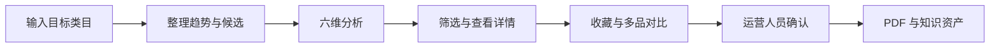

# AI 智能选品助手

面向中小跨境卖家的 AI 选品产品作品集。V1 聚焦 TikTok Shop 美国站，帮助运营人员从市场趋势中发现值得继续研究的潜力商品，并把分散的竞品、供应链、物流和合规信息整理成可比较的参考意见。

[在线体验 AI 选品助手](https://azo11.github.io/ai-product-radar/)

> 当前版本：v1.0.0 交互式 Mock Demo。市场数据、用户研究、AI 输出、Dify、Hermes 和飞书流程均为模拟；筛选、排序、六维评分、参数重算、收藏、对比、状态流转和 PDF 生成由前端真实执行。


## 为什么做

新手卖家和小型运营团队常用热门内容、商品页、竞品工具和供应商页面拼凑选品判断。查商品情况和寻找竞品耗时最长，却有大量候选最终不值得继续研究。V1 将这些低收益的信息整理工作前置自动化，让运营人员把时间用在样品、供应商和合规核验上。

## 核心流程



六个参考维度为需求增长、传播潜力、参考利润空间、供应稳定性、物流友好度和合规安全度。权重用于控制研究优先级，不设置一票否决；AI 只提供证据和建议，最终决定由运营人员作出。

## V1 能力

| 能力 | 当前实现 |
| --- | --- |
| 创建任务 | 类目必选，支持预设或自定义类目；采购成本和重量可选 |
| 执行轨迹 | 交互式展示规则、Dify、Hermes 和异常状态 |
| 候选研究 | 搜索、筛选、排序、六维评分、风险与证据摘要 |
| 深入判断 | 商品详情、价格成本情景重算、收藏和最多四品对比 |
| 报告资产 | 浏览器真实生成 PDF，Mock 保存飞书并演示失败恢复 |
| 测评资产 | 40 条合成案例、28/12 固定划分、7 类 Bad Case |

## Demo 与生产边界

| 当前 Demo | 真实生产应用设计 |
| --- | --- |
| 本地合成商品与预生成分析 | 官方 API、授权数据服务商、供应链和内部经营数据 |
| 前端 Mock Dify 节点 | Dify 编排真实变量、分支和运行日志 |
| 前端 Mock Hermes 日志 | Hermes 在受控权限下调用采集、清洗与内部工具 |
| 前端规则计算 | 服务端规则引擎版本化、校验并持久化 |
| Mock 飞书保存 | 服务端授权写入企业知识库并回读验证 |
| 合成测评方法演示 | 运营专家标注、离线评测、用户测试和业务指标 |

完整说明见[产品作品集](docs/AI智能选品助手-产品作品集.md)、[数据来源与接入策略](docs/数据来源与接入策略.md)、[能力对照](docs/Demo与生产能力对照.md)和 [v1.0.0 发布清单](docs/发布清单-v1.0.0.md)。

## 本地运行

需要 Node.js 22 或更高版本。

```bash
npm install
npm run dev
```

生产构建与验证：

```bash
npm test
npm run eval:validate
npm run build
```

## 项目结构

```text
src/                  Demo 交互、合成商品与评分规则
scripts/              合成测评集生成和校验脚本
docs/adr/             产品与架构决策记录
docs/feishu/          飞书企业知识库模拟资产
docs/evaluation/      测评方案、数据集、评审模板和 Bad Case
assets/screenshots/   真实 Demo 页面截图
```

## 证据边界

本项目能够证明产品流程、信息架构、规则计算、交互状态、异常设计和评测方法已经形成可运行 Demo；不能证明真实用户需求、模型效果、平台接入能力或销量、利润和效率提升。详细口径见 [ADR-004](docs/adr/ADR-004-synthetic-research-and-demo-evidence.md) 和 [ADR-008](docs/adr/ADR-008-public-interactive-mock-only.md)。

## 路线图

- V1 下一步：验证真实数据源、接入受控服务端、邀请运营专家标注并开展可用性测试。
- V2：AI Listing 优化助手。
- V3：AI 运营分析助手。
- V4：自动化运营 Agent。

当前只实施和评估 V1，V2-V4 不属于已完成能力。

## License

[MIT](LICENSE)
