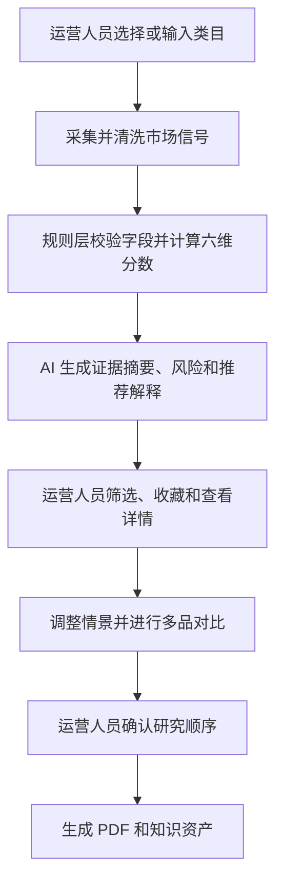
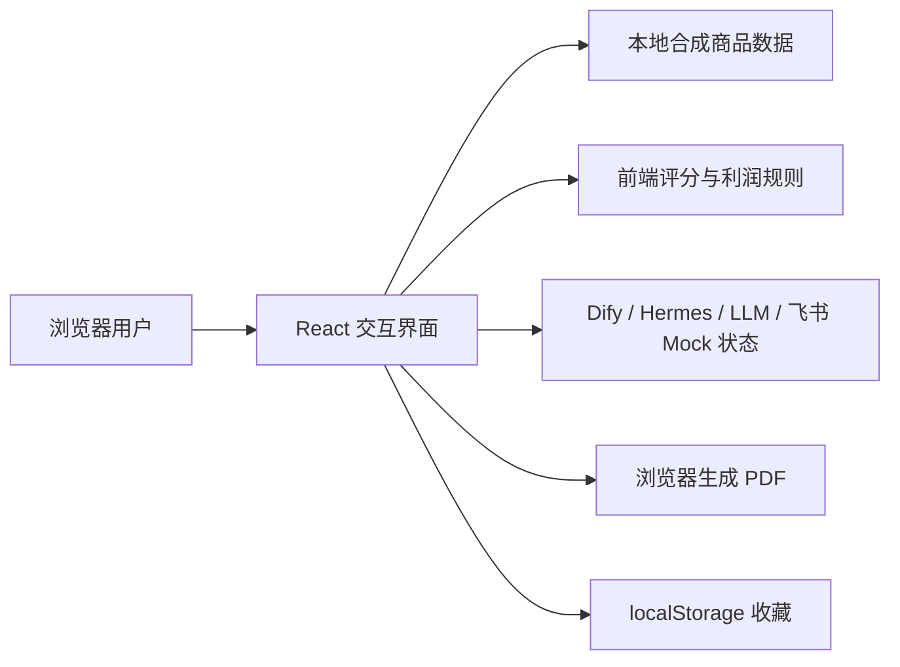
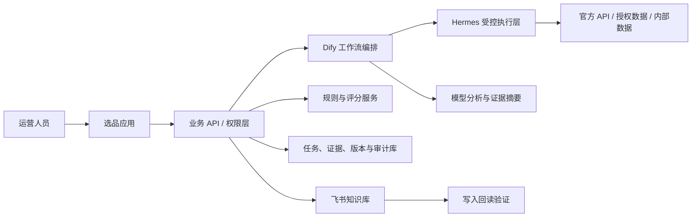
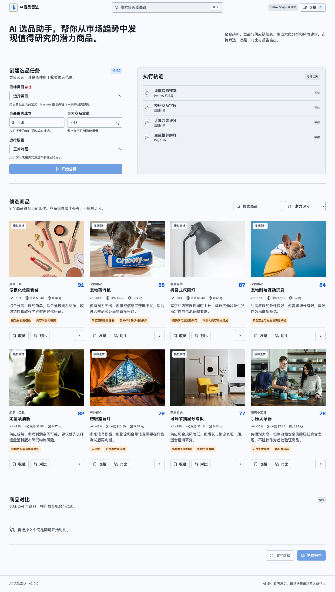
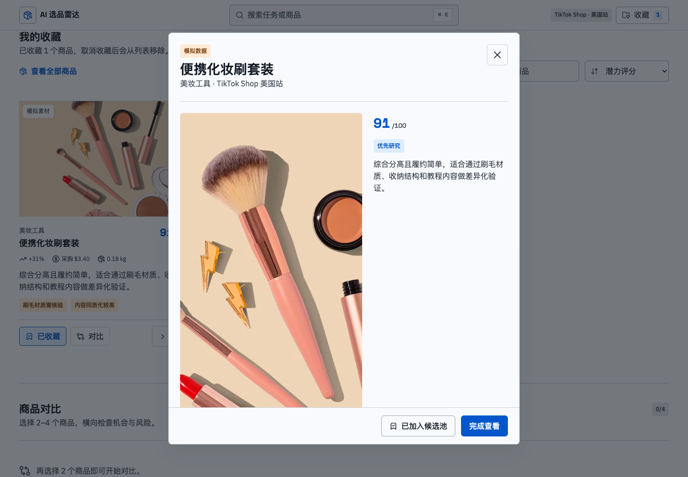
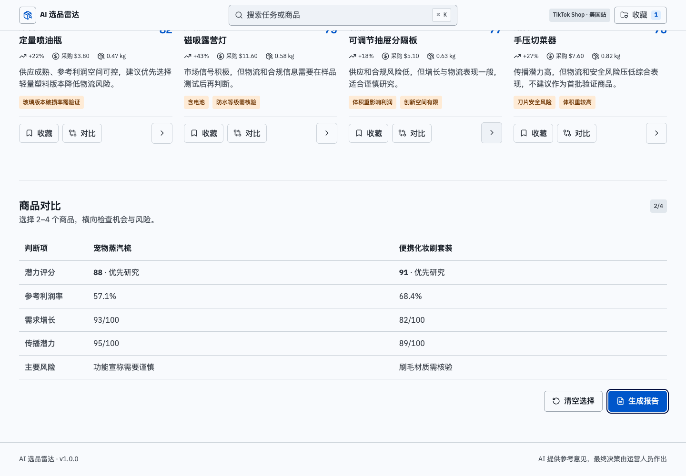
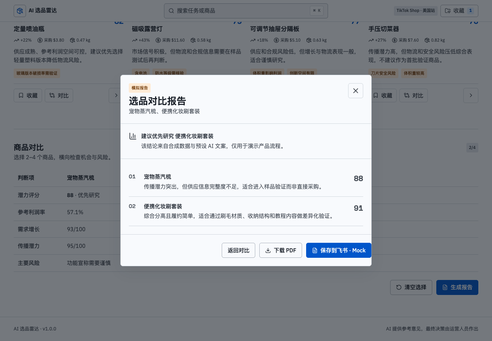

# AI 智能选品助手 Demo 产品说明

| 项目 | 内容 |
| --- | --- |
| 产品界面名称 | AI 选品雷达 |
| 版本 | v1.0.0 |
| 目标平台 | TikTok Shop 美国站 |
| 项目类型 | 公开交互式 AI 产品 Mock Demo |

> 证据说明：项目使用虚拟用户研究、合成商品数据和预生成 AI 内容，用于验证产品流程、交互、规则与评测方法。当前没有真实用户访谈、平台数据接入、模型运行、运营专家标注或经营效果数据。

## 01 项目背景

### 业务问题

中小跨境卖家在选品早期需要反复查看热门内容、商品详情、竞品价格、供应商、物流和合规信息。信息分散且口径不一致，运营人员会花费大量时间查询商品和寻找竞品，最后却发现很多候选品缺乏利润空间、供应不稳定或存在合规风险。

真正需要优化的不是替运营人员自动决定“卖什么”，而是降低发现和排查候选商品的成本，让有限的人力更快集中到值得做样品、供应商和内容验证的商品上。

### 项目目标

帮助新手个体卖家和小型运营团队从市场趋势中发现潜力商品，把趋势、内容、竞品、供应链、物流和合规信号整理为结构化参考意见，并保留人工最终决策。

### V1 范围

V1 从“输入类目”开始，到“形成可供会审的候选报告”结束，覆盖：

1. 创建类目研究任务。
2. 查看执行过程和数据异常。
3. 筛选、排序并查看候选商品。
4. 收藏、对比和调整价格成本情景。
5. 人工确认后生成 PDF 和知识资产。

真实平台采集、真实模型调用、真实飞书写入和自动采购不属于 V1 已实现范围。

### 成功标准

- 用户能完成从类目到对比报告的闭环。
- 评分、排序和参数重算可以复算。
- AI 建议引用输入证据、披露风险且不作结果保证。
- 数据缺失和外部服务失败有明确状态与恢复路径。
- Demo 能清晰说明当前实现与生产架构之间的差距。

## 02 用户研究

### 研究方法与局限

受项目条件限制，本阶段无法接触真实目标用户，因此采用虚拟用户画像、模拟任务访谈和合成业务场景形成产品假设。研究结果用于指导原型，不作为真实用户验证证据。

正式验证需要补充 5-8 名 TikTok Shop 美国站卖家或运营人员访谈、任务观察和原型可用性测试。

### 核心用户

| 用户 | 特征 | 主要需求 |
| --- | --- | --- |
| 新手个体卖家 | 数据工具有限，依赖教程和人工搜索 | 快速找到值得继续研究的方向，避免明显风险 |
| 小型运营团队 | 多人协作但流程依赖表格和经验 | 统一判断口径，沉淀候选证据和会审结果 |

### 核心任务

> 当我准备研究一个类目时，我希望快速看见近期趋势和代表性候选，并了解利润、供应、物流与合规风险，以便决定哪些商品值得进入下一轮样品和供应商验证。

### 当前旅程与痛点

| 阶段 | 当前行为 | 主要问题 | 产品机会 |
| --- | --- | --- | --- |
| 找趋势 | 浏览热门内容、榜单和关键词 | 热度不等于持续需求 | 同时展示增长幅度、持续时间和冲突信号 |
| 查商品 | 逐个打开商品页 | 字段分散，重复整理 | 形成统一候选卡片和详情证据 |
| 找竞品 | 搜索相似品并记录价格 | 同质化高，价格口径混乱 | 提供竞品价格带和内容参考，不替用户定价 |
| 查货源 | 比较采购、MOQ、交期和资料 | 信息完整度差异大 | 展示供应稳定性和缺失字段 |
| 做判断 | 用表格和经验综合取舍 | 规则不透明、难复盘 | 六维参考、风险披露和人工状态留痕 |

### 已形成的关键假设

- 首要价值是发现值得研究的潜力商品，不是自动给出最终选品答案。
- 查商品和找竞品是耗时最明显、但存在大量低收益劳动的环节。
- 竞品是需求、内容、价格和同质化判断的证据，不应成为独立评分维度。
- 用户需要调整权重和情景，但任何维度都不应自动一票否决。
- 推荐必须说明风险与不确定性，运营人员拥有最终决策权。

## 03 产品方案

### 产品定位

AI 智能选品助手是“研究优先级助手”，将多个来源的市场信号整理成可解释的候选清单，帮助运营人员决定下一步研究什么。

它不承担最终定价、自动采购、合规审批或销量预测责任。

### 产品流程



### 核心功能

| 模块 | 关键设计 | 产品价值 |
| --- | --- | --- |
| 选品任务 | 类目必选，采购成本和重量可选 | 先明确研究边界，再收窄候选 |
| 执行轨迹 | 展示节点、状态、失败和降级 | 让 AI 工作流可观察、可解释 |
| 候选列表 | 分数、趋势、成本、价格带、风险和理由 | 支持快速扫描和优先级判断 |
| 商品详情 | 六维证据、竞品参考、供应说明和情景重算 | 避免只看一个总分 |
| 收藏与对比 | 全局收藏入口，最多四个商品对比 | 支持从浏览转入深入研究 |
| 报告 | 自动排序、人工确认、PDF 和飞书资产 | 支持会审、复盘和知识沉淀 |

### 六维参考框架

| 维度 | 临时权重 | 关注问题 |
| --- | ---: | --- |
| 需求增长 | 25% | 需求是否增长、持续多久、是否存在冲突信号 |
| 传播潜力 | 20% | 卖点是否适合短视频展示，内容是否同质化 |
| 参考利润空间 | 20% | 竞品价格带相对采购和物流成本是否留有空间 |
| 供应稳定性 | 15% | 供应商数量、MOQ、交期和资料是否稳定 |
| 物流友好度 | 10% | 重量、体积、易碎、电池和敏感属性 |
| 合规安全度 | 10% | 禁限售、认证、材质、宣称和使用安全 |

权重是待验证的产品参数，不是行业事实。总分表示研究优先级，不代表热销概率、最终毛利率或上架成功率。

竞品价格带中位值只用于参考利润空间情景测算；最终售价还需结合平台佣金、营销、退货、税费、仓储和经营策略确定。

### 人机职责边界

| 角色 | 负责 | 不负责 |
| --- | --- | --- |
| 规则系统 | 字段校验、费用计算、加权分、状态与版本 | 自由生成事实或替用户决策 |
| AI | 整理证据、解释趋势、提示风险、生成建议 | 承诺销量、利润、合规或供应稳定 |
| 运营人员 | 定义类目、核验证据、调整参数、最终决策 | 被系统分数强制替代判断 |

## 04 AI 架构设计

### 当前 Demo 架构



当前没有后端、数据库、真实模型、Dify 工作流、Hermes Provider 或飞书 API。外部图片来自公开图片服务，商品属性和分析内容均为合成案例。

### 真实生产应用目标架构



### 组件职责

- Dify：编排节点、变量、分支、重试和运行记录，不承担业务数据库职责。
- Hermes：在系统授予的工具和数据范围内采集、读取、清洗、归类和总结，不自行决定类目。
- 模型：基于结构化证据生成解释，并记录模型、提示词和引用版本。
- 规则服务：计算确定性指标，管理权重、阈值、置信度和版本。
- 业务系统：负责身份、权限、任务、持久化、幂等、审计和降级。
- 飞书：保存人工确认后的可读知识资产，不作为唯一事实数据库。

### 安全与治理

- 只接入官方、授权或经过合规评估的数据来源。
- Hermes 使用最小权限工具白名单，限制目标域、速率、超时和输出格式。
- AI 输出必须引用本次任务证据；缺失字段不能被模型补写成事实。
- 飞书写入使用幂等键并在写入后回读标题、版本和关键字段。
- 高风险商品保留参考意见，但必须降低置信度、披露风险并要求人工核验。

## 05 原型设计

### 信息架构

```text
AI 选品雷达
├── 创建任务
├── 执行轨迹
├── 候选商品
│   ├── 搜索 / 筛选 / 排序
│   ├── 我的收藏
│   └── 商品详情
├── 商品对比
└── 选品报告
    ├── PDF 下载
    └── 飞书保存 Mock
```

### 关键设计决策

1. 第一屏直接进入任务工作台，不使用营销式落地页。
2. 类目由运营人员定义，避免 Hermes 自行生成模糊或不可控的研究范围。
3. 候选卡片同时展示分数、证据和风险，避免总分成为黑盒结论。
4. 收藏提供全局入口，确保用户能重新找到已标记商品。
5. 详情页允许调整参考价格和采购成本，用情景重算表达不确定性。
6. 报告同时生成本地 PDF，并把飞书保存设计成独立状态。

### 原型截图

| 工作台与候选 | 商品详情 |
| --- | --- |
|  |  |

| 商品对比 | 报告预览 |
| --- | --- |
|  |  |

移动端完整页面见 [`overview-mobile.png`](../assets/screenshots/overview-mobile.png)。

### 异常与降级

Demo 可切换字段缺失、Hermes 读取失败和飞书保存失败。目标生产系统还需覆盖模型超时、重复提交、价格异常、数据冲突、电池运输和安全敏感品等情况。

失败处理遵循四条原则：不伪造成功、保留已完成结果、说明影响范围、提供有限且可追踪的恢复动作。

## 06 Demo 展示

### 演示脚本

1. 选择“美妆工具”或输入自定义类目，创建选品任务。
2. 查看执行轨迹，说明当前 Dify 与 Hermes 为交互式 Mock。
3. 在候选列表按潜力分、增长或参考利润空间排序。
4. 收藏便携化妆刷套装，并通过顶栏“收藏”重新查看。
5. 打开商品详情，查看六维证据并修改参考价格或采购成本。
6. 将便携化妆刷套装和宠物蒸汽梳加入对比。
7. 生成报告并下载真实 PDF。
8. 演示 Mock 飞书保存成功，再切换失败场景说明恢复设计。

### 实现状态

| 能力 | 状态 | 证据 |
| --- | --- | --- |
| 筛选、排序、收藏和对比 | 已实现 | 浏览器真实交互 |
| 六维评分和情景重算 | 已实现 | TypeScript 规则与单元测试 |
| PDF 下载 | 已实现 | 浏览器生成 PDF 文件 |
| Dify、Hermes 和模型 | Mock | 预设节点、状态和文本 |
| 飞书保存 | Mock | 本地 Markdown 与 JSON 资产 |
| 真实市场数据 | 未接入 | 使用 8 个合成商品案例 |

## 07 效果评估

### 当前已完成

- 40 条合成商品案例，其中校准集 28 条、留出集 12 条。
- 5 个类目，每类 8 条案例。
- 7 类 Bad Case，覆盖短期峰值、合规缺失、供应稀疏、价格离散、数据冲突、电池运输和使用安全。
- 每条案例包含结构化证据、可复算分数、必须披露风险和禁止承诺。
- 人工评审模板保留空白，不冒充运营专家标注。

### 已验证结果

| 校验项 | 结果 | 能证明什么 |
| --- | ---: | --- |
| 案例数量 | 40 | 数据文件和方案数量一致 |
| 数据划分 | 28 / 12 | 校准和留出边界固定 |
| 分数复算 | 40 / 40 | 固定输入和权重得到一致总分 |
| Bad Case | 7 | 关键风险已形成回归资产 |
| 飞书 Mock 资产 | 5 | 本地源文档与写入载荷可对应 |

这些结果是规则和数据资产校验，不是模型准确率、专家认可或业务效果。

### 尚未计算的指标

- Top-5 专家命中率和三档专家一致率。
- AI 证据支持率、风险披露率和禁止承诺违规率。
- 人工修改率、研究任务完成时间和可用性问题。
- 真实销量、利润、退货或选品效率变化。

### 正式评测方案

1. 邀请至少两名有目标市场经验的运营人员独立标注。
2. 只用校准集调整权重、阈值和提示词，锁定后运行留出集。
3. 保存每次模型输出、提示词、模型版本、数据快照和日志。
4. 分开报告模型质量、产品可用性和真实业务效果。
5. 所有失败案例进入 Bad Case 库并形成回归标准。

## 08 后续规划

### V1 下一阶段：从 Demo 到真实验证

1. 建立数据源与字段矩阵，完成授权、成本、稳定性和合规评估。
2. 接入服务端任务与规则服务，把权重、评分和证据版本化。
3. 使用 Dify 编排工作流，Hermes 在受控权限下执行数据工具。
4. 接入真实模型输出和飞书知识库写入回读。
5. 完成运营专家标注、原型可用性测试和有限类目试点。

### 远期路线图

| 版本 | 方向 | 与 V1 的关系 |
| --- | --- | --- |
| V2 | AI Listing 优化助手 | 使用已确认商品与证据生成可审核 Listing |
| V3 | AI 运营分析助手 | 接入经营数据，分析流量、转化、利润和异常 |
| V4 | 自动化运营 Agent | 在权限、审批和审计下执行低风险运营动作 |

V2-V4 仅为方向规划，当前没有实现或验证。

## 项目产出与产品经理职责

- 完成 V1 范围、用户假设、产品流程、业务规则和验收标准。
- 设计 AI、规则系统与人工决策边界。
- 设计 Dify、Hermes、服务端和飞书的生产职责分工。
- 构建可交互 Demo，覆盖主流程、失败场景和报告输出。
- 建立合成测评集、人工评审模板和 Bad Case 回归资产。
- 明确数据来源责任：产品经理负责字段、来源策略和可行性验收，研发负责接口与采集实现，商务和法务共同负责授权、成本与合规。

## 一分钟项目总结

我把选品问题定义为“提高候选研究效率”，而不是让 AI 自动决定卖什么。V1 先让运营人员输入类目，再将趋势、内容、竞品、供应链、物流和合规信号整理为六维参考意见，支持筛选、收藏、对比和报告。Demo 使用合成数据，真实实现了规则计算和交互状态，Dify、Hermes、模型与飞书采用 Mock；同时设计了生产架构、数据接入策略和 40 条合成测评集。最终决策始终由运营人员完成，后续只有取得真实数据、专家标注和运行记录后，才会发布模型或业务效果。

## 相关资产

- [数据来源与接入策略](./数据来源与接入策略.md)
- [Demo 与生产能力对照](./Demo与生产能力对照.md)
- [V1 验收标准](./v1-acceptance-criteria.md)
- [飞书模拟资产](./feishu/README.md)
- [测评资产](./evaluation/README.md)
- [架构决策记录](./adr/ADR-001-v1-product-scope.md)
