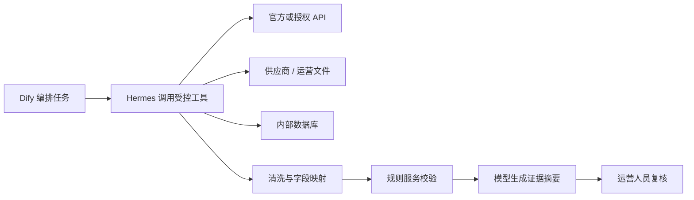

# 数据来源与接入策略

> 当前状态：生产方案设计。V1 Demo 使用本地合成数据，以下数据源均未在本项目中完成接口、授权或商业可行性验证。

## 1. 产品经理是否需要负责找接口

产品经理需要对“需要什么数据、为什么需要、能否稳定合法获得、如何验收”负责，但通常不需要亲自编写接口。

| 角色 | 主要职责 |
| --- | --- |
| 产品经理 | 定义指标、字段、使用场景、优先级、更新频率、证据要求和降级方案；推动可行性验证 |
| 技术 / 数据工程师 | 验证 API、连接器和采集方式；实现字段映射、清洗、监控与存储 |
| 商务 / 采购 | 洽谈第三方数据授权、价格、额度和服务承诺 |
| 法务 / 安全 | 审查平台条款、知识产权、隐私、跨境传输和访问权限 |
| 运营专家 | 判断字段是否有业务意义，参与标签制定和结果评审 |

产品经理的核心交付物是数据源与字段矩阵、数据供应商评估、数据契约和验收标准，而不是接口代码。

## 2. V1 需要的数据

| 数据域 | 核心字段 | 用途 | 建议更新频率 | 候选来源 | 当前状态 |
| --- | --- | --- | --- | --- | --- |
| 市场趋势 | 关键词热度、增长幅度、持续时间、区域 | 需求增长判断 | 日 / 周 | 平台公开趋势工具、搜索趋势服务、授权数据商 | 待验证 |
| 内容传播 | 视频量、互动、增速、内容主题、同质化 | 传播潜力判断 | 日 | 平台公开内容工具、授权社媒数据商 | 待验证 |
| 商品竞品 | 商品、价格带、销量或排名代理信号、评价主题 | 价格和竞争参考 | 日 / 周 | 官方开放接口、授权市场情报服务、允许访问的公开页面 | 待验证 |
| 供应链 | 采购价、MOQ、交期、供应商数、资料完整度 | 供应稳定判断 | 周 / 按任务 | 供应商报价、采购上传、授权供应链数据 | 待验证 |
| 物流 | 重量、尺寸、敏感属性、运费、时效 | 物流难度判断 | 月 / 报价变化 | 物流商报价、承运商 API、内部费率表 | 待验证 |
| 合规 | 禁限售、认证、材质、标签、宣称和安全要求 | 风险提示 | 规则变化时 | 平台规则、监管机构、合规服务商、人工审核 | 待验证 |
| 内部经营 | 订单、广告、退货、完整成本和利润 | 后续验证推荐效果 | 日 | 店铺授权 API、ERP、财务和广告系统 | V1 不接入 |

TikTok Shop 或其他平台的开放能力、字段范围、申请条件和价格可能变化。进入开发前必须查阅当期官方文档或与授权服务商确认，不能把“公开可见”直接等同于“允许批量采集”。

## 3. 数据源优先级

按以下顺序选择数据入口：

1. 官方 API 或官方导出。
2. 已获得明确授权的数据服务商。
3. 企业内部数据、供应商文件和运营人员上传。
4. 经过条款与技术评估的公开网页采集。
5. 无法获取时使用人工录入或明确标记的缺失状态。

Hermes 不能凭空产生真实市场数据。它必须通过被授权的 API、文件、数据库或网页工具执行采集，并受到目标域、字段、速率、超时和审计规则约束。

## 4. 数据源评估矩阵

每个候选接口或供应商至少按以下项目评估：

| 评估项 | 核心问题 | 通过标准示例 |
| --- | --- | --- |
| 字段覆盖 | 是否包含业务判断必需字段 | 必填字段覆盖率达到约定标准 |
| 时效 | 延迟是否满足趋势研究 | 提供更新时间和延迟说明 |
| 稳定性 | 限流、失败率和 SLA 如何 | 有重试、限流和故障通知机制 |
| 可追溯 | 能否保存来源、时间和原始引用 | 每条证据有来源 ID 与抓取时间 |
| 合规授权 | 是否允许目标用途、存储和再展示 | 合同、平台条款或授权范围明确 |
| 成本 | 按调用、账号或数据量如何收费 | 有试点预算和超额控制 |
| 可替换性 | 数据商失效后是否可切换 | 业务字段与供应商字段解耦 |
| 数据质量 | 缺失、重复、异常和偏差如何 | 质量规则可监控并输出报告 |

## 5. 建议的数据契约

每条证据至少保存：

```json
{
  "evidence_id": "EV-20260723-001",
  "task_id": "TASK-20260723-001",
  "source_provider": "provider_name",
  "source_type": "official_api",
  "source_record_id": "external_record_id",
  "collected_at": "2026-07-23T10:00:00Z",
  "market": "US",
  "category": "美妆工具",
  "field": "reference_price_band",
  "value": [14, 24],
  "currency": "USD",
  "confidence": "medium",
  "missing_reason": null,
  "snapshot_version": "data-v1"
}
```

AI 解释只能引用当前任务中的证据 ID；缺失数据必须保留 `missing_reason`，不能由模型自行补全。

## 6. Hermes 与 Dify 的数据职责



- Dify 负责节点顺序、输入输出、分支、重试和运行日志。
- Hermes 负责按白名单调用工具并返回结构化数据，不自行修改业务规则。
- 规则服务负责必填字段、单位、币种、异常值、权重和版本校验。
- 模型负责总结与解释，不生成未经来源支持的事实。
- 运营人员负责核验、补证和最终选择。

## 7. 缺失与降级策略

| 缺失情况 | 产品行为 |
| --- | --- |
| 趋势持续时间缺失 | 不描述为持续增长，降低证据置信度 |
| 竞品价格离散 | 展示区间和样本量，不给出单一确定售价 |
| 供应商样本过少 | 保留候选但提示供应稳定性待核验 |
| 合规或材质字段缺失 | 强制披露风险并生成补证任务 |
| 数据源不可用 | 保留已有结果，标记失败来源和更新时间，允许限次重试 |
| 多来源冲突 | 并列展示冲突证据，交给运营人员复核 |

## 8. 分阶段接入建议

### 阶段一：单类目可行性验证

- 选择一个低合规风险类目。
- 接入一个趋势来源、一种竞品来源和供应商人工上传。
- 验证字段覆盖、证据引用、任务耗时和失败率。

### 阶段二：受控试点

- 接入 Dify、Hermes、规则服务、模型和任务数据库。
- 邀请运营人员对校准集标注并修正权重。
- 对真实报告执行飞书写入和回读验证。

### 阶段三：生产扩展

- 增加类目、数据商和内部经营数据。
- 建立权限、成本、质量、审计、告警和供应商替换机制。
- 分开评估模型质量、产品效率和业务效果。

## 9. 接口验收清单

- 字段、单位、币种、时区和市场定义一致。
- 请求限额、分页、重试、超时和错误码有记录。
- 样本数据可追溯到来源记录和采集时间。
- 缺失、重复、异常和冲突数据有处理规则。
- 授权范围允许存储、分析和在企业内部展示。
- 不在前端或公开仓库保存密钥、令牌和内部文档 ID。
- 数据源失效时有降级方案，不由模型生成替代事实。
